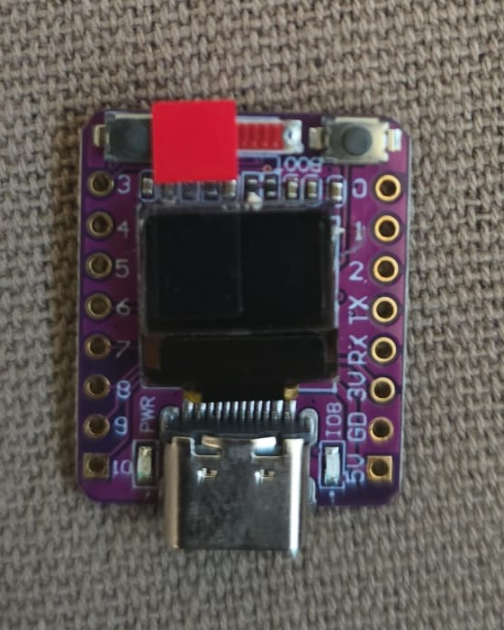

# InoVolt BMS

Local ESP32 gateway for up to six Bluetooth batteries advertised as `TP_...`.

## Integrare Home Assistant cu card UI inclus

Integrarea InoVolt BMS pentru Home Assistant este livrată împreună cu un card UI Lovelace dedicat. Cardul afișează SOC-ul, tensiunea, curentul, puterea, diferența dintre celule, toate cele 16 tensiuni și indicatoarele individuale de balansare.

Vezi [tutorialul complet](docs/HOME_ASSISTANT_CARD.md) și [configurația exemplu](examples/home-assistant-card.yaml).

## Product behaviour

1. On first boot the ESP32 creates Wi-Fi network `inovolt` with password `12345678`.
2. The local captive page scans customer Wi-Fi networks and nearby `TP_...` batteries.
3. The customer selects and names between one and six batteries.
4. The ESP32 stores the configuration locally, joins the customer LAN and reboots.
5. Selected batteries are polled sequentially and exposed through the native ESPHome API.

Each selected battery is a separate Home Assistant device. Selecting two
batteries creates only `InoVolt Battery 1` and `InoVolt Battery 2`; slots 3–6 are
not registered or exposed.

The BLE scheduler connects to one battery at a time, requests the complete frame
set, disconnects, and advances to the next configured slot. A missing response
times out without blocking Wi-Fi or the Home Assistant API.

No MQTT broker, cloud account or external web asset is required.

## Hardware profiles

- ESP32-S3 with PSRAM: recommended for one to six batteries.
- ESP32-C3: supported for one or two batteries.

### ESP32-C3 with integrated OLED

For compact ESP32-C3 boards with an integrated SSD1306 72×40 OLED, use
`examples/inovolt-c3-oled.yaml`. The display alternates between the clock and
five-second pages for each configured battery. GPIO5/GPIO6 and address `0x3C`
match the current InoVolt test board. The safe default is 400 kHz I²C; 800 kHz
can be tested per board but is not required.

This clean implementation is under active development. Do not install it in a
customer system until the firmware build and real-battery verification checklist
in `docs/TESTING.md` is complete.
