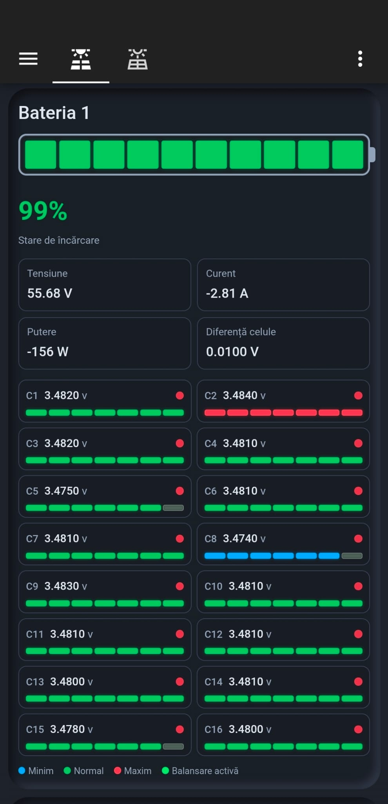

# InoVolt Battery Card pentru Home Assistant

Integrarea InoVolt BMS pentru Home Assistant include și cardul UI Lovelace. Cardul afișează SOC-ul, valorile electrice principale, diferența dintre celule, tensiunile individuale ale celor 16 celule și starea balansării.

## Instalare

1. Descarcă `inovolt-battery-card.js` din rădăcina repository-ului și copiază-l în `/config/www/inovolt-battery-card.js` pe Home Assistant.
2. Deschide **Settings → Dashboards → Resources** și adaugă:

   `/local/inovolt-battery-card.js?v=1`

   Tipul resursei este **JavaScript Module**.
3. Reîncarcă pagina Home Assistant fără cache.
4. Adaugă un card manual și copiază configurația din `examples/home-assistant-card.yaml`.
5. Înlocuiește ID-urile entităților cu cele afișate în Home Assistant pentru bateria ta.

## Comportament

- celula sau celulele cu tensiunea maximă sunt roșii;
- celula sau celulele cu tensiunea minimă sunt albastre;
- celelalte celule sunt verzi;
- LED-ul fiecărei celule este verde când balansarea este activă și roșu când este oprită;
- apăsarea unei celule sau valori deschide istoricul Home Assistant;
- bara celulei are implicit 7 segmente;
- bateria din antet folosește SOC-ul și praguri de culoare configurabile.

`equal_tolerance` stabilește când două tensiuni sunt considerate egale. Valoarea `0.001` înseamnă 1 mV.

Pentru mai multe baterii, adaugă câte un card și schimbă entitățile și titlul fiecăruia.
